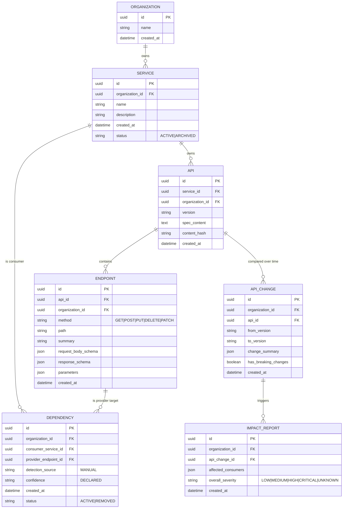

# ERD — Entity Relationship Diagram

**Status:** Draft — P1-01, P1-02, P1-03 complete (Phase 1 DoD met)
**Last updated:** 2026-09-24

This document describes the entity relationships as both a Mermaid ER diagram and plain-text relationship notes. It is the canonical companion to `domain-model.md` (which holds the per-entity invariants and lifecycle).

---

## Mermaid ER Diagram

---

## Relationship Notes

### Organization → Service
- **Cardinality:** `1 : 0..*`
- An Organization owns zero-to-many Services. Every Service belongs to exactly one Organization.

### Service → Api
- **Cardinality:** `1 : 0..*`
- A Service owns zero-to-many Api records (multiple versions allowed for FR-008 diffing). Every Api belongs to exactly one Service.

### Api → Endpoint
- **Cardinality:** `1 : 0..*`
- An Api contains zero-to-many Endpoints. Every Endpoint belongs to exactly one Api.

### Service (consumer) → Dependency → Endpoint (provider)
- **Cardinalities:** each Dependency has exactly one `consumer_service_id` and exactly one `provider_endpoint_id`.
- This is the *implicit M:N* relationship between Services (as consumers) and Endpoints (as providers). It is NOT a junction table with extra semantics — a Dependency row simply records a single "consumer calls provider endpoint" fact.
- The implicit graph (`Service M : N Endpoint`) is what the Graph Engine (Phase 5) traverses via Dependency rows.

### Api → ApiChange
- **Cardinality:** `1 : 0..*`
- An Api generates zero-to-many comparison records. Each ApiChange references exactly one Api and exactly two distinct version identifiers (`from_version`, `to_version`).

### ApiChange → ImpactReport
- **Cardinality:** `1 : 0..*`
- An ApiChange may trigger zero-to-many ImpactReports (re-runs append new reports per FR-017). Each ImpactReport references exactly one ApiChange.

---

## Tenant Scoping (X-INV-01 / NFR-009)

Every entity has its own `organization_id` (or inherits it through its parent). The invariant: **all entities reachable from any other entity must share the same `organization_id`.** The base scoped-repository (P1-03) enforces this structurally.

For entities that are reached transitively rather than having a direct column (e.g., the provider Service of an Endpoint, or the ApiChange's parent Service), the org consistency is guaranteed by the FK chain:
- Endpoint's org = its Api's org = its Service's org = the root Organization's org.
- ApiChange's org = its Api's org.
- ImpactReport's org = its ApiChange's org.
- Dependency's org = consumer Service's org = provider Endpoint's org (cross-column check, INV-DEP-07).

---

## Deferred Entities (Not in MVP ERD)

- `User` / `AuthSession` — Phase 15
- `AuditLog` — Phase 15
- `GitHubPullRequest` / `WebhookEvent` — Phase 10
- `AnalysisRun` — Phase 10+ (only if a concrete need emerges)

These are deliberately absent from the diagram to keep the MVP schema surface minimal.
