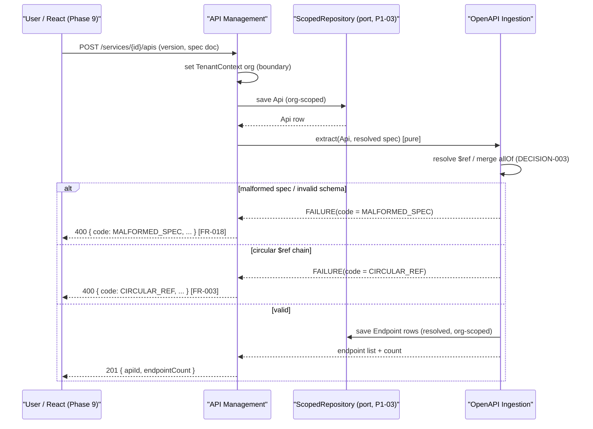
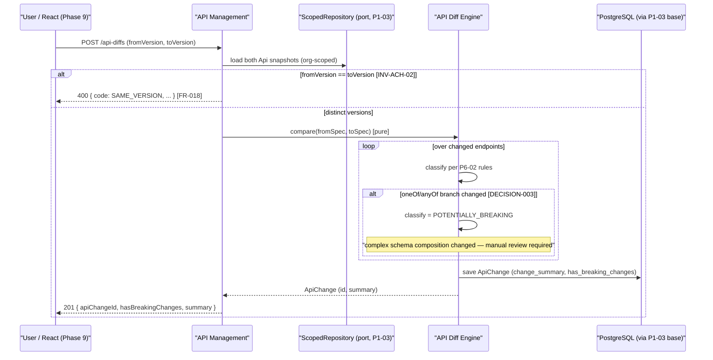
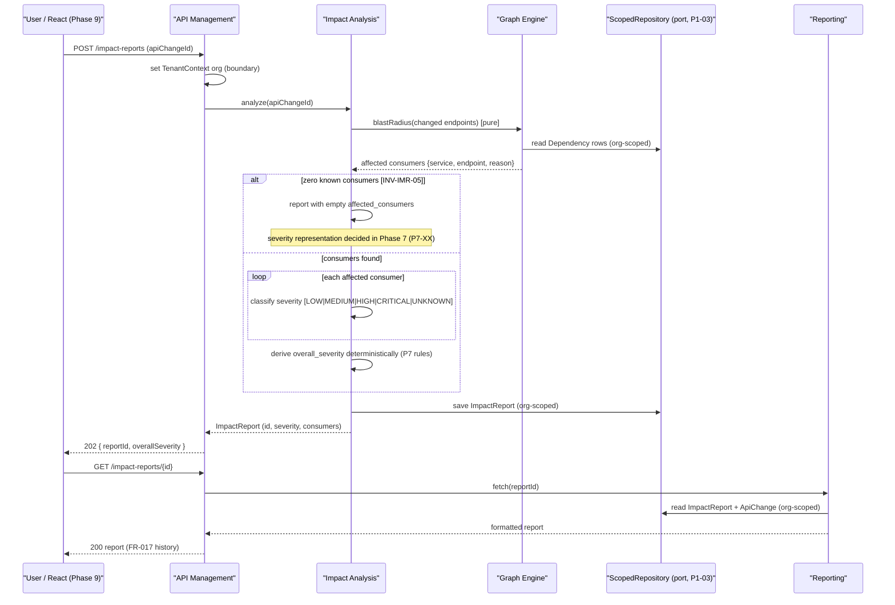

# Sequence Diagrams — Core Loop

**Status:** Design — P2-02 complete
**Last updated:** 2026-09-24
**Companion:** `docs/architecture.md`, `docs/component-diagram.md`

These diagrams show the MVP loop — **ingest → diff → impact report** — in three parts. Participants are
exactly the P2-01 components (plus `User`, the backend boundary, and the scoped-repository port). Every call
is synchronous in-process; there are no queues, events, or async signals anywhere (Phase 12 is deferred).
**FACT:** REST terminology in the diagrams (`POST /…`) is the Phase 8 target shape; no code exists yet.

---

## 1. Spec Ingest (FR-003, DECISION-003)

Notes: endpoints are stored fully dereferenced per DECISION-003 (INV-EP-05); `oneOf`/`anyOf` branches are
preserved, not flattened — the Diff Engine treats them specially (Diagram 2).

---

## 2. Version Diff (FR-008)

Notes: classification is deterministic (identical inputs → identical `change_summary`, NFR-008);
`has_breaking_changes` is materialized at write time and never drifts (INV-ACH-03).

---

## 3. Impact Report (FR-010/012/013)

---

## Traceability

| Diagram | Flow | Maps to | Failure branches shown |
|---------|------|---------|------------------------|
| 1 | ingest → endpoints | FR-003, DECISION-003, INV-EP-05 | malformed spec, circular `$ref` |
| 2 | version diff → ApiChange | FR-008, DECISION-003, INV-ACH-02/03 | same-version, `oneOf`/`anyOf` manual review |
| 3 | impact → report | FR-010/012/013, NFR-008, INV-IMR-05(open) | zero consumers |

## Boundary & determinism rules applied to every diagram

- `TenantContext` is set at the API Management boundary before the first port call; co-scoped reads/writes
  are implied by every `PERS`/`PORT` interaction (P1-03 contract).
- The analysis engines (Ingestion, Diff, Graph, Impact) perform no I/O that is not a declared port call;
  nothing reaches PostgreSQL except through the `ScopedRepository` base (NFR-008, P1-03 rule 4).
- No async signals (`-->` is used only for returns), no queues, no event bus, no GitHub actor in the MVP
  loop.